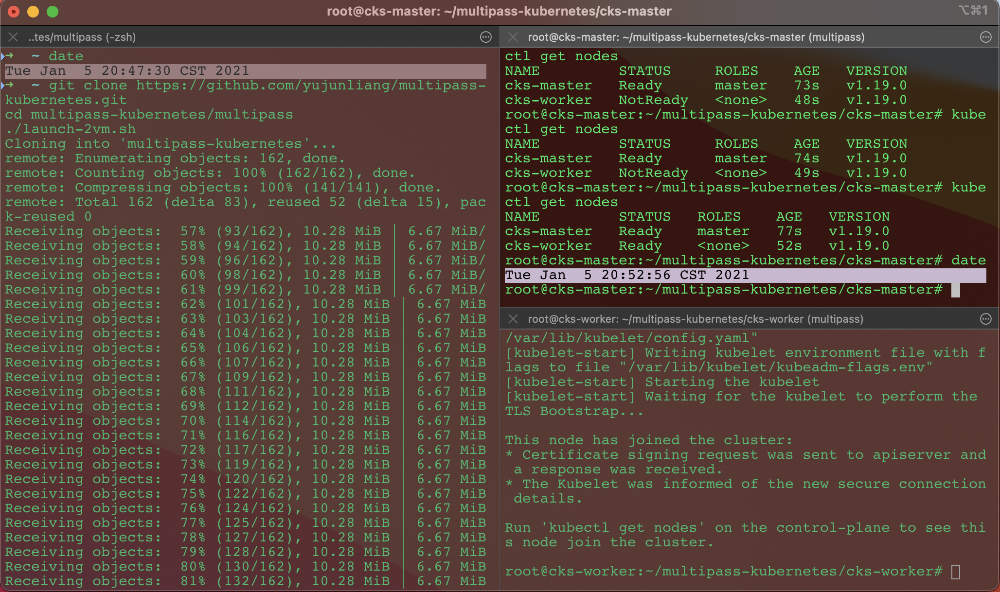

#  Cluster Made Easy!

You can use [Multipass](https://multipass.run/) to create two Ubuntu VMs and then set up a Kubernetes cluster on these two VMs. It only takes less than 6 minutes.


Terminal [iTerm2](https://iterm2.com/) pane layout,

```
+-----------------------+-----------------------+
| macOS                 | cks-master            |
|=======================|=======================|
| $ pwd                 | $ pwd                 |
| /Users/yujunliang     | /Users/yujunliang     |
|                       +-----------------------+
|                       | cks-worker            |
|                       |=======================|
|                       | $ pwd                 |
|                       | /Users/yujunliang     |
+-----------------------+-----------------------+
```

## Screenshot

If you substract the time, it only takes 5 minutes and 26 seconds.





## Installation steps

These are the links to install and create kubernetes cluster,

0. Download [multipass](https://multipass.run/) manually.
1. [Container runtimes](https://kubernetes.io/docs/setup/production-environment/container-runtimes/)
2. [Installing kubeadm](https://kubernetes.io/docs/setup/production-environment/tools/kubeadm/install-kubeadm/)
3. [Creating a cluster with kubeadm](https://kubernetes.io/docs/setup/production-environment/tools/kubeadm/create-cluster-kubeadm/)

### Step 1. Create two Ubuntu VMs on macOS pane,

```
git clone https://github.com/yujunliang/multipass-kubernetes.git
cd multipass-kubernetes/multipass
./launch-2vm.sh
```

### Step 2. On cks-master pane,

```
cd multipass-kubernetes/multipass
./ssh-to-cks-master.sh
```

when in cks-master VM, execute the following commands

```
sudo -i
git clone https://github.com/yujunliang/multipass-kubernetes.git
cd multipass-kubernetes/cks-master
./install-all.sh
```
copy the output like this,

```
kubeadm join 192.168.64.3:6443 --token al0kvi.x60mi1xj4zesqnq3     --discovery-token-ca-cert-hash sha256:f4ff0c7684bbac599a8208b94bb28e451023662ab51bc1ce16f60a855a85e2a5
```

### Step 3. On cks-worker pane,

```
cd multipass-kubernetes/multipass
./ssh-to-cks-worker.sh
```

when in cks-worker,execute the following commands

```
sudo -i
git clone https://github.com/yujunliang/multipass-kubernetes.git
cd multipass-kubernetes/cks-worker
./install-all.sh
```

then run what you copied from Step 2, something like this,

```
kubeadm join 192.168.64.3:6443 --token al0kvi.x60mi1xj4zesqnq3     --discovery-token-ca-cert-hash sha256:f4ff0c7684bbac599a8208b94bb28e451023662ab51bc1ce16f60a855a85e2a5
```

### Step 4. On second window, cks-master

```
# kubectl get nodes
NAME         STATUS   ROLES    AGE   VERSION
cks-master   Ready    master   34h   v1.19.0
cks-worker   Ready    <none>   34h   v1.19.0

# kubectl run nginx --image=nginx
pod/nginx created

# kubectl get pod
NAME    READY   STATUS    RESTARTS   AGE
nginx   1/1     Running   0          19s
```


Follow me on [LinkedIn](https://www.linkedin.com/in/yujunliang/)
